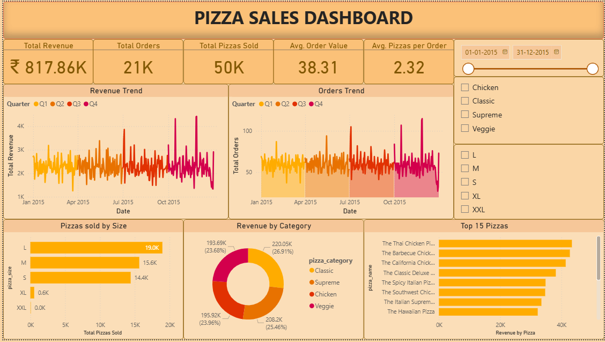

# Pizza Sales Analytics Dashboard

## Project Overview

This project is an interactive Pizza Sales Analytics Dashboard developed using Power BI to analyze pizza sales performance and generate business insights.

The dashboard helps monitor:
- Revenue trends
- Order performance
- Product category analysis
- Pizza size distribution
- Top-performing pizzas
- Sales KPIs

---

# Tools & Technologies Used

- Power BI
- DAX
- Power Query
- Data Visualization
- Sales Analytics

---

# Dashboard Features

## Sales KPIs
- Total Revenue
- Total Orders
- Total Pizzas Sold
- Average Order Value
- Average Pizzas per Order

## Sales Analysis
- Revenue Trend Analysis
- Order Trend Monitoring
- Revenue by Pizza Category
- Pizza Size Distribution

## Product Performance
- Top 15 Best-Selling Pizzas
- Category-wise Revenue Analysis
- Interactive Date Filtering
- Dynamic Dashboard Slicers

---

# Dashboard Screenshot

---

# Key Business Insights

- Large-sized pizzas contribute the highest sales volume.
- Classic category generates the highest revenue contribution.
- Revenue and orders show stable growth patterns throughout the year.
- Certain pizza variants consistently outperform others in sales revenue.
- KPI analysis helps monitor overall business performance effectively.

---

# Project Workflow

1. Data Collection
2. Data Cleaning & Transformation
3. Data Modeling
4. DAX Calculations
5. Dashboard Development
6. Sales Insight Generation

---

# Files Included

- `.pbix` dashboard file
- Dashboard screenshot
- Project documentation

---

# How to Use

1. Download the `.pbix` file
2. Open using Power BI Desktop
3. Explore dashboard filters and visualizations

---

# Author

Aryan Sharan
